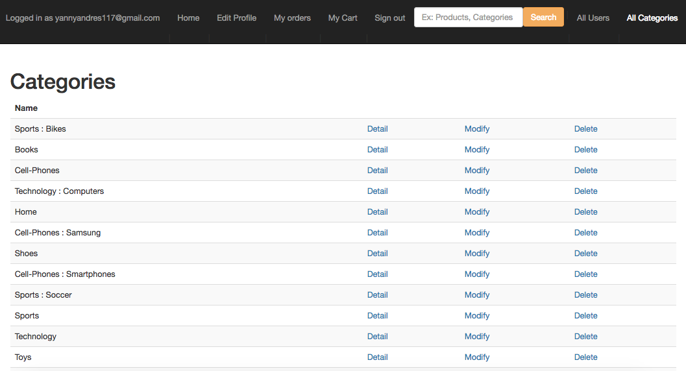

# Ecommerce_store

### Description
An e-commerce store that sells a variety of products using server side framework Ruby on Rails.

| Home Page     | Category Page               |
|---------------|                             |
| | |

## Functionalities
* Separates 'user' role for 'admins'.
  - Admin manages the products inventory, view orders, categories/subcategories and user's information on customers.
* Categories can be dynamically created by the admin (i.e. Science Fiction), and all products should be assigned to a category.
* Separate 'user' role for 'customers'.
  - Customers can purchase items only if they are registered users and are able to track status of their orders.
* Follows a standard practice for a shopping cart, and have appropriate search (using Solr) and filters on product pages (i.e. by category, by price).
* Able to create and manage the status of your orders.
* Uses `devise` power gem to manage user authentication.
* Follows a very easy to navigate interface.
(Bootstrap for front-end).

## Instructions to execute code

#### Production
* Project Url: https://ecommerce-store-kalebr.herokuapp.com/home
  - Search Engine functionality not working on productions because you're entitle to pay ($15/month) to have an instance of SORL running in production.
  - Admin credentials
    * username: admin@gmail.com
    * password: admin123
  - Create regular user on the application.

#### Development
* Clone the repository from Github.
  - https://github.com/yannycastrillon/ecommerce_store
* Open a terminal, go to your proyect's directory and run `bundle install` --> Install all your dependencies gems.
* Must run this command `rails db:create`, `rails db:migrate` to run db migrations.
* Later you must run:
* `rails s`  for the application to work on "localhost:3000".
* We must run the sunspot Solr server locally to be able to have search functionality. `RAILS_ENV=development bundle exec rake sunspot:solr:start`.

## Rspec
* Make sure all testing specs are green.
  - Run the command `RAILS_ENV=test bundle exec rake sunspot:solr:start`. To start Solr server on testing environment. (This will create the write.lock file on Solr directory).

    

  - Run specs `bundle exec rspec spec`.

    

## Entity Model

## What's next!

- Incorportate **Twillio Authy** for **2-factor** authentication during a purchase.
- Refactor to make code DRY.

